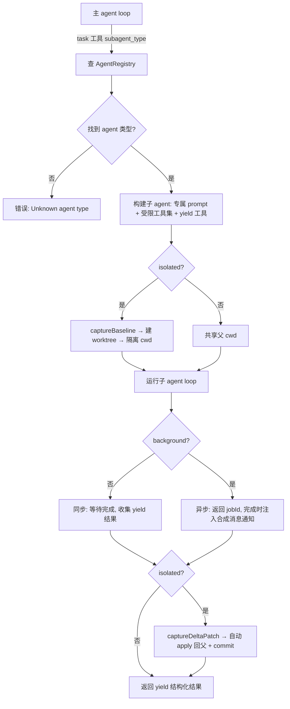

# 多 Agent 特性 — 设计文档

> 日期：2026-06-30
> 状态：已批准（待实现）
> 参考：opencode `packages/opencode/src/agent/`、oh-my-pi `packages/coding-agent/src/task/`

## 1. 目标与范围

为 c0de-agent 增加**可配置的多 agent 类型**能力：主 agent 通过 `task` 工具按类型派发专门的子 agent，每个子 agent 拥有专属 prompt、受限工具集、可选的 git worktree 文件隔离，支持单消息内并行派发、后台异步执行与 session 恢复。

### 范围

| 能力 | 说明 |
|------|------|
| Agent 类型注册表 | markdown frontmatter 定义 + discovery + 内置默认 |
| 增强 task 工具 | `subagent_type` 派发 + 专属 prompt + 工具集隔离 + 递归限制 |
| yield 结构化结果 | 子 agent 用专用 `yield` 工具返回结构化数据（outputSchema 验证） |
| 并行派发 | 单消息 `tasks[]` 批量，concurrency pool |
| 后台 subagent | `background:true` 异步，完成时注入通知 |
| Session 恢复 | parentId 关联，重启后重建树，运行中后台任务标 parked |
| 可选 worktree 隔离 | agent 声明 `isolated:true`，diff **自动 apply 回父** |
| 前端接线 | SubAgentProgress 接线 + 新 AgentEvent |

### 非目标

- IRC 跨 agent 通信（oh-my-pi 式）—— 超出范围
- 嵌套 repo 处理 —— 仅单仓库 worktree
- agent 类型在 UI 中可选切换（前端 agent 选择器）—— 后续

## 2. 现状分析

c0de-agent **已有**基础 subagent 基础设施：

- `src/tools/builtin/task.ts`：依赖反转的 task 工具，通过 `ctx.runSubAgent` 调用 host
- `src/core/loop.ts:runSubAgent()`：创建隔离子 session、abort 链接、model 覆盖，子 agent 继承父的全部工具和 prompt
- `src/shared/types/tool.ts`：`SubAgentRequest`（prompt/description/model）、`SubAgentResult`
- DB `sessions.parentId`：已支持父子关系
- `src/web/components/SubAgentProgress.tsx`：前端组件已写，**但未接线**（无后端 subagent 事件）

**缺口**：无 agent 类型概念；子 agent 无专属 prompt/工具集；无并行/后台/恢复；无 worktree 隔离；前端组件悬空。

## 3. 架构总览

```
src/core/agents/              ← 新模块（agent 类型化基础设施）
  ├─ types.ts                 AgentDefinition, AgentRegistry 接口
  ├─ registry.ts              AgentRegistry（内存 Map<name, definition>）
  ├─ discovery.ts             .c0de/agents/*.md frontmatter 加载 + 三级合并
  ├─ builtin.ts               内置默认 agent（general/coder/researcher/reviewer）
  └─ index.ts                 barrel

src/core/loop.ts              ← 增强 runSubAgent（消费 AgentDefinition）
src/core/worktree.ts          ← 新（可选 worktree 隔离：baseline/delta/apply）
src/tools/builtin/task.ts     ← 增强 task 工具（subagent_type + 并行 + 后台）
src/tools/builtin/yield.ts    ← 新（子 agent 结构化结果返回 + outputSchema 验证）
src/shared/types/agent.ts     ← 新增 subagent_* AgentEvent 变体
src/web/                      ← SubAgentProgress 接线 + SSE
```



## 4. 组件详述

### 4.1 AgentDefinition（`src/core/agents/types.ts`）

```ts
type AgentSource = 'builtin' | 'user' | 'project'

interface AgentDefinition {
  name: string                          // 唯一标识，如 'researcher'
  description: string                   // 何时用此 agent（注入 task 工具描述）
  systemPrompt: string                  // 专属 system prompt（frontmatter 正文）
  tools?: string[]                      // 允许的工具集（默认全部注册工具）
  model?: string                        // 模型覆盖（默认继承父）
  mode: 'subagent' | 'primary' | 'all'  // 可见性（subagent=仅子用，primary=仅主，all=皆可）
  isolated?: boolean                    // 是否用 worktree 隔离（默认 false）
  maxRecursion?: number                 // 递归派生深度上限（默认 0=禁止递归 task）
  outputSchema?: object                 // yield 结果的 JSON Schema（验证子 agent 输出）
  source: AgentSource                   // 来源
  filePath?: string                     // markdown 路径（调试）
}
```

**设计依据**：oh-my-pi `AgentDefinition`（name/description/systemPrompt/tools/model/spawns/isolated），裁剪掉 thinkingLevel/blocking/autoloadSkills/readSummarize（c0de-agent 不需要）。`maxRecursion` 取代 oh-my-pi 的 `spawns: string[]|"*"`，用数字深度更直观。

### 4.2 AgentRegistry（`src/core/agents/registry.ts`）

```ts
interface AgentRegistry {
  register(def: AgentDefinition): void
  get(name: string): AgentDefinition | undefined
  list(mode?: 'subagent' | 'primary' | 'all'): AgentDefinition[]
  has(name: string): boolean
}

function createAgentRegistry(): AgentRegistry
```

内存 `Map<name, AgentDefinition>`。`list('subagent')` 返回 task 工具可选的 agent 类型（注入 task 工具描述）。

### 4.3 Discovery（`src/core/agents/discovery.ts`）

**加载顺序**（后者覆盖同名前者）：
1. `builtin.ts` 内置默认（source: 'builtin'）
2. 用户全局 `~/.c0de/agents/*.md`（source: 'user'）
3. 项目 `.c0de/agents/*.md`（source: 'project'）

**Markdown frontmatter 解析**：

```markdown
---
name: researcher
description: 只读代码调研专家，用 grep/glob/read 快速摸清结构后返回压缩上下文
tools: [grep, glob, read]
model: deepseek/deepseek-v4
isolated: false
maxRecursion: 0
outputSchema:
  type: object
  properties:
    summary: { type: string }
  required: [summary]
---
You are a read-only codebase scout. ...
```

- frontmatter 用 YAML 解析（`gray-matter` 或手写简易解析器，避免新依赖优先手写）
- 正文（`---` 之后）为 `systemPrompt`
- `name` 缺省时取文件名（去扩展名）

**函数签名**：

```ts
async function loadAgents(projectDir: string): Promise<AgentDefinition[]>
async function loadAgentFile(filePath: string, source: AgentSource): Promise<AgentDefinition | null>
```

### 4.4 内置默认 Agent（`src/core/agents/builtin.ts`）

4 个内置 agent（参考 oh-my-pi `prompts/agents/`）：

| name | description | tools | 用途 |
|------|-------------|-------|------|
| `general` | 通用助手，全工具 | 全部（含 task，maxRecursion=1） | 默认子 agent |
| `coder` | 实现专家，专注写代码 | read/write/edit/bash/grep/glob | 写实现 |
| `researcher` | 只读调研，返回压缩上下文 | grep/glob/read | 探索代码 |
| `reviewer` | 代码审查，返回结构化发现 | grep/glob/read | 审查质量 |

每个内置 agent 的 `systemPrompt` 在 `builtin.ts` 内联（参考 oh-my-pi `prompts/system/subagent-system-prompt.md` 的 worker 模板）。

**通用 subagent worker 模板**（所有内置 agent 共享的骨架，叠加各自角色）：

```
You are a worker agent for delegated tasks.

You have access to: {tools}. Use them as needed.

<directives>
- Finish only the assigned work. Do not repeat what you wrote to filesystem.
- Be concise. Never include filler. The user cannot see you. Your result is notes for the main agent.
- Prefer narrow lookups (grep/glob), then read only needed ranges.
- Never create documentation files unless requested.
</directives>

{role-specific prompt}

When done, call the `yield` tool with your result.
```

### 4.5 增强 task 工具（`src/tools/builtin/task.ts`）

**两种调用形态**：

*单任务*：
```ts
{
  subagent_type: string,       // 必填，agent 类型名
  prompt: string,              // 必填，自包含的任务描述
  description?: string,        // 显示标签
  background?: boolean,        // 后台异步（默认 false）
}
```

*批量并行*：
```ts
{
  subagent_type: string,       // 所有子任务共用同一 agent 类型
  context: string,             // 共享上下文
  tasks: Array<{               // 并行子任务
    description?: string,
    role?: string,             // 角色细分（注入 prompt）
    assignment: string,        // 子任务内容
  }>,
}
```

**派发协议**（`runSubAgent` 增强）：

```ts
type SubAgentRequest = {
  agentType: string              // ← 新增，替代原来的隐式 general
  prompt: string
  description?: string
  role?: string                  // 批量模式的角色细分
  context?: string               // 批量模式的共享上下文
  model?: string
  background?: boolean
}

type SubAgentResult =
  | { _tag: 'success'; output: string; sessionId: string; data?: unknown; patchPath?: string }
  | { _tag: 'error'; error: string; sessionId?: string }
  | { _tag: 'running'; jobId: string; sessionId: string }  // ← 后台模式立即返回
```

**`runSubAgent` 增强逻辑**（`src/core/loop.ts`）：

1. `deps.agentRegistry.get(request.agentType)` → 未找到返回 error
2. 构建 childConfig：`{ ...parent.config, model: def.model ?? request.model ?? parent.config.model, tools: def.tools ?? 全部 }`
3. 构建 childSystemPrompt：`def.systemPrompt` + worker 模板注入（role/context/assignment）
4. **工具集隔离**：childState.tools 只含 `def.tools` 声明的；递归 task 仅当 `def.maxRecursion > 当前深度` 时注册
5. **worktree**：若 `def.isolated`，先 `captureBaseline` → 建 worktree → child cwd = worktree path
6. **yield 工具**：注册到 child 工具集，子 agent 调用时收集结构化结果（验证 outputSchema）
7. **事件**：发出 `subagent_start`/`subagent_progress`/`subagent_end` AgentEvent
8. **后台**：若 `background`，fork 异步，立即返回 `{ _tag:'running', jobId }`；完成时向父 session 注入合成消息
9. **worktree 回传**：若 isolated，子 agent 完成后 `captureDeltaPatch` → 自动 apply 回父 + commit；失败则 patchPath 附在结果中
10. 返回 yield 收集的 `data`（若有）或 text output

### 4.6 yield 工具（`src/tools/builtin/yield.ts`）

子 agent 专用，返回结构化结果。

```ts
const yieldTool: ToolDef = {
  name: 'yield',
  description: 'Submit your final structured result. This is the ONLY way to return a result.',
  parameters: {
    type: 'object',
    properties: {
      data: { type: 'object', description: 'Your structured result (must match outputSchema if declared).' },
      type: { type: 'string', description: 'Optional section label for incremental yields.' },
      status: { type: 'string', enum: ['success', 'aborted'] },
      error: { type: 'string', description: 'If blocked, describe what you tried.' },
    },
  },
  permission: 'auto',
  execute: async (input, ctx) => {
    // 验证 outputSchema（若 AgentDefinition 声明）
    // 收集到 ctx 的 yield 收集器（runSubAgent 注入）
    // 返回 success，但 yield 后子 agent loop 应终止
    ctx.collectYield?.(input)
    return { _tag: 'success', output: 'Result submitted.' }
  },
}
```

**关键**：yield 工具调用后，子 agent loop 检测到 yield 并优雅终止（而非继续循环）。通过 `ToolContext` 新增 `collectYield?` 回调，`runSubAgent` 注入收集器。

### 4.7 并行派发（`src/core/loop.ts`）

批量模式 `tasks[]` 用 concurrency pool（参考 oh-my-pi `parallel.ts`）：

```ts
async function runSubAgentsParallel(
  deps: LoopDeps,
  parent: AgentState,
  agentType: string,
  context: string,
  tasks: Array<{ description?: string; role?: string; assignment: string }>,
): Promise<SubAgentResult[]>
```

- concurrency 限制可配（默认 `config.subagentConcurrency ?? 3`）
- worker pool 模式：`mapWithConcurrencyLimit`
- 每个 worker 调用 `runSubAgent`（role/assignment 作为 prompt）
- abort 时取消未启动的，保留已完成结果
- 结果按输入顺序装配

**并发控制实现**（`src/core/agents/parallel.ts`）：

```ts
async function mapWithConcurrencyLimit<T, R>(
  items: T[],
  concurrency: number,
  fn: (item: T, index: number, signal: AbortSignal) => Promise<R>,
  signal?: AbortSignal,
): Promise<{ results: (R | undefined)[]; aborted: boolean }>
```

### 4.8 后台 subagent + 恢复

**后台执行**：
- `background: true` → `runSubAgent` fork 到 Promise（不 await），立即返回 `{ _tag:'running', jobId, sessionId }`
- 子 agent 完成时，向父 session 注入合成用户消息：
  ```
  <task id="{sessionId}" state="completed">
  <summary>{description}</summary>
  <task_result>{output}</task_result>
  </task>
  ```
  触发父 agent SSE 推送 + 继续处理
- 父 agent 此时若在 task 工具 await，收到的是 `{ _tag:'running' }`，应结束当前回复（提示用户后台运行中）

**恢复**：
- DB `sessions.parentId` 已支持。新增 `sessions.agentType`、`sessions.worktreePath` 字段
- 重启后通过 parentId 重建 agent 树
- 运行中的后台任务：进程内状态丢失，标记为 `parked`（session 历史完整可查，但不续传执行）
- `AgentRegistry`（server 级，区别于 agent 类型注册表）跟踪活跃 run 的状态——**复用现有 `AgentManager`**（`src/server/agent-manager.ts`），扩展记录 childId/agentType

### 4.9 可选 worktree 隔离（`src/core/worktree.ts`）

仅当 `AgentDefinition.isolated === true` 时启用。**c0de-agent 简化版**（单仓库，自动 apply 回父）。

**流程**：

1. **captureBaseline**（子 agent 运行前）：
   ```ts
   interface RepoBaseline {
     repoRoot: string
     headCommit: string
     staged: string       // staged diff patch
     unstaged: string     // unstaged diff patch
     untracked: string[]  // untracked 文件列表
     untrackedPatch: string
   }
   async function captureBaseline(cwd: string): Promise<RepoBaseline>
   ```
   用 `git` CLI（通过 bash 工具或直接 child_process）。

2. **建隔离 worktree**：
   ```ts
   async function createWorktree(repoRoot: string, branchName: string): Promise<string>
   // git worktree add <tmp-dir> -b <branch> HEAD
   // 返回 worktree path 作为子 agent cwd
   ```

3. **captureDeltaPatch**（子 agent 完成后）：
   ```ts
   async function captureDeltaPatch(worktreeDir: string, baseline: RepoBaseline): Promise<string>
   // 合成 baseline tree → 当前 tree → diff
   ```

4. **自动 apply 回父**（oh-my-pi 式）：
   ```ts
   async function applyPatchToParent(
     repoRoot: string,
     patch: string,
     commitMessage?: string,
   ): Promise<{ commitSha: string; warnings: string[] }>
   // git apply + git add + git commit
   // commitMessage 默认 "agent(isolated): {description}"
   ```

**错误处理**：
- worktree 创建失败 → 回退到共享 cwd，记录警告
- apply 冲突 → patch 附在结果中返回，不自动 commit，父 agent 决策
- worktree 清理：子 agent 结束后 `git worktree remove`（无论成功失败）

### 4.10 前端接线

**新增 AgentEvent 变体**（`src/shared/types/agent.ts`）：

```ts
type AgentEvent =
  | ... 现有 ...
  | { _tag: 'subagent_start'; childId: string; agentType: string; description: string; background: boolean }
  | { _tag: 'subagent_progress'; childId: string; toolName?: string; intent?: string; status: 'running'|'completed'|'failed' }
  | { _tag: 'subagent_end'; childId: string; agentType: string; success: boolean; output?: string }
```

**SubAgentProgress 接线**：
- SSE 流转发 subagent_* 事件
- 前端 hook `useSubAgents(sessionId)` 收集事件
- `SubAgentProgress.tsx` 渲染运行中/完成的子 agent 卡片
- task 工具结果渲染时关联对应 subagent 卡片

### 4.11 DB 变更

`sessions` 表加字段（migration）：

```ts
// src/db/schema.ts
agentType: text('agent_type'),        // 子 session 用的 agent 类型名（null=主 session）
worktreePath: text('worktree_path'),  // 隔离 worktree 路径
```

migration SQL + schema 更新 + `rowToSession` 映射更新。

### 4.12 配置变更

`Config` 新增：

```ts
interface Config {
  ...
  agents: {
    dir: string              // agent markdown 目录，默认 '.c0de/agents'
    subagentConcurrency: number  // 并行子 agent 数，默认 3
  }
}
```

## 5. 数据流（典型场景）

### 5.1 单任务派发（researcher）

```
用户 → 主 agent: "调研 auth 模块"
主 agent → task 工具: { subagent_type: 'researcher', prompt: '...' }
task 工具 → ctx.runSubAgent({ agentType: 'researcher', prompt })
runSubAgent:
  1. registry.get('researcher') → AgentDefinition
  2. createSession(parentId=父, agentType='researcher')
  3. createAgent(子 session, config with researcher.tools + researcher.model)
  4. childSystemPrompt = researcher.systemPrompt + worker 模板
  5. 注册 yield 工具到子 agent
  6. emit subagent_start
  7. runAgent(子 state, [{_tag:'text', text: prompt}])
     → 子 agent 用 grep/glob/read 调研
     → 子 agent 调用 yield({ data: { summary, files } })
     → yield 收集器存结果，子 loop 终止
  8. emit subagent_end
  9. return { _tag:'success', data: { summary, files }, sessionId }
task 工具 → 返回 ToolResult（含 data）
主 agent → 基于结果继续回复用户
```

### 5.2 批量并行

```
主 agent → task 工具: { subagent_type: 'coder', context: '重构 X', tasks: [
  { role: 'API 层', assignment: '...' },
  { role: '测试层', assignment: '...' },
]}
task 工具 → runSubAgentsParallel(deps, parent, 'coder', '重构 X', tasks)
  → mapWithConcurrencyLimit(tasks, 3, runSubAgent)
  → 3 个子 agent 并行运行（各自 isolated session）
  → 等待全部完成，按序装配结果
返回汇总结果给主 agent
```

### 5.3 后台 + worktree 隔离

```
主 agent → task 工具: { subagent_type: 'coder', prompt: '...', background: true }
coder.isolated === true
runSubAgent:
  1. captureBaseline(父 cwd)
  2. createWorktree → worktreePath
  3. createSession(parentId, agentType='coder', worktreePath)
  4. 子 agent cwd = worktreePath
  5. fork 异步运行（不 await）
  6. 立即返回 { _tag:'running', jobId, sessionId }
主 agent → 收到 running，提示用户后台运行中，结束回复

[异步] 子 agent 完成:
  7. captureDeltaPatch(worktreePath, baseline) → patch
  8. applyPatchToParent(父 cwd, patch) → commit
  9. 向父 session 注入合成消息 <task state="completed">...</task>
  10. 父 agent SSE 推送，用户看到完成通知
  11. git worktree remove（清理）
```

## 6. 测试策略

### 单元测试

| 模块 | 测试文件 | 覆盖 |
|------|----------|------|
| `agents/registry.ts` | `agents/registry.test.ts` | register/get/list/has，mode 过滤，覆盖同名 |
| `agents/discovery.ts` | `agents/discovery.test.ts` | frontmatter 解析，三级合并顺序，缺省 name 取文件名 |
| `agents/builtin.ts` | `agents/builtin.test.ts` | 4 个内置 agent 字段完整 |
| `agents/parallel.ts` | `agents/parallel.test.ts` | concurrency 限制，abort 取消，结果顺序，fail-fast |
| `worktree.ts` | `worktree.test.ts` | baseline 捕获，delta 计算，apply（用临时 git repo） |
| `task.ts`（增强） | `builtin/task.test.ts`（追加） | subagent_type 派发，未知类型报错，工具集隔离 |
| `yield.ts` | `builtin/yield.test.ts` | outputSchema 验证，collectYield 回调 |
| `loop.ts`（runSubAgent 增强） | `loop.test.ts`（追加） | 专属 prompt，后台返回 running，并行装配 |

### 集成测试

- `integration/multi-agent.test.ts`：端到端——主 agent 派发 researcher，mock chatStream 返回 task 工具调用，验证子 session 创建、工具集隔离、yield 收集
- `integration/subagent-parallel.test.ts`：批量 tasks[] 并行，验证并发限制和结果装配
- `integration/subagent-worktree.test.ts`：isolated agent 的 worktree 创建/diff/apply 全流程（临时 git repo）

**Mock 策略**：复用现有 `LoopDeps` 的 fake `chatStream` 模式（mock 子 agent 也调 task 工具→ yield）。

## 7. 实现顺序（内部依赖）

虽是单 spec，实现按依赖顺序推进（每步可独立验证）：

1. **基础设施**：`agents/types.ts` + `registry.ts` + `discovery.ts` + `builtin.ts`（无外部依赖，纯数据）
2. **DB + 配置**：schema 加字段 + migration + Config.agents
3. **yield 工具**：`yield.ts` + ToolContext 加 collectYield
4. **增强 runSubAgent**：消费 AgentDefinition，专属 prompt + 工具集隔离 + yield + subagent 事件
5. **增强 task 工具**：subagent_type 参数 + 调用增强 runSubAgent
6. **并行派发**：`parallel.ts` + 批量 tasks[] 参数
7. **后台 subagent**：background 参数 + 异步 + 注入通知
8. **worktree 隔离**：`worktree.ts` + isolated agent 流程
9. **前端接线**：AgentEvent + SSE + SubAgentProgress
10. **恢复**：parentId 树重建 + AgentManager 扩展

## 8. 风险与缓解

| 风险 | 缓解 |
|------|------|
| worktree git 操作跨平台（Windows 路径/权限） | 用 POSIX 路径，worktree 测试仅在非 Windows 跑；提供 `isolated:false` 回退 |
| 后台任务进程内状态重启丢失 | session 历史完整持久化，标 parked，用户可手动重新派发 |
| yield 工具与现有 loop 终止逻辑冲突 | yield 后设特殊终止标志，loop 检测后 break（不影响主 agent） |
| 递归 task 无限派生 | maxRecursion 默认 0，registry 按深度决定是否注册 task 工具 |
| 并行子 agent 文件冲突（共享 cwd） | isolated agent 用 worktree；非 isolated 在 prompt 强调不重叠 |
| 子 agent 工具集为空 | def.tools 为空时回退到全部工具（而非空集，避免卡死） |

## 9. 兼容性

- 现有 `task` 工具调用（无 subagent_type）→ 向后兼容，默认 `agentType='general'`
- 现有 `runSubAgent` 签名变更 → 更新所有调用点（loop.ts 内部，单一调用点）
- DB migration 向后兼容（新字段 nullable）
- 现有无 agent 配置的项目 → discovery 仅返回 builtin，行为与现状一致

## 10. 文件清单（新增/修改）

**新增**：
- `src/core/agents/types.ts`
- `src/core/agents/registry.ts`
- `src/core/agents/discovery.ts`
- `src/core/agents/builtin.ts`
- `src/core/agents/parallel.ts`
- `src/core/agents/index.ts`
- `src/core/worktree.ts`
- `src/tools/builtin/yield.ts`
- 各自 `.test.ts`

**修改**：
- `src/core/loop.ts`（runSubAgent 增强 + 批量并行）
- `src/core/types.ts`（AgentDependencies 加 agentRegistry）
- `src/core/config.ts`（Config.agents）
- `src/core/agent.ts`（createAgent 接收 agentType）
- `src/tools/builtin/task.ts`（subagent_type + 批量）
- `src/shared/types/tool.ts`（SubAgentRequest/Result 增强）
- `src/shared/types/agent.ts`（subagent_* AgentEvent）
- `src/shared/types/config.ts`（AgentsConfig）
- `src/shared/types/message.ts`（SessionMetadata 加 agentType）
- `src/db/schema.ts`（sessions 加 agentType/worktreePath）
- `src/db/migrate.ts`（migration）
- `src/session/session.ts`（rowToSession 映射）
- `src/server/agent-manager.ts`（扩展记录 childId/agentType）
- `src/server/routes/chat.ts`（SSE 转发 subagent 事件）
- `src/web/`（SubAgentProgress 接线 + hook）
- `src/server/index.ts` / `src/server/context.ts`（装配 agentRegistry）
