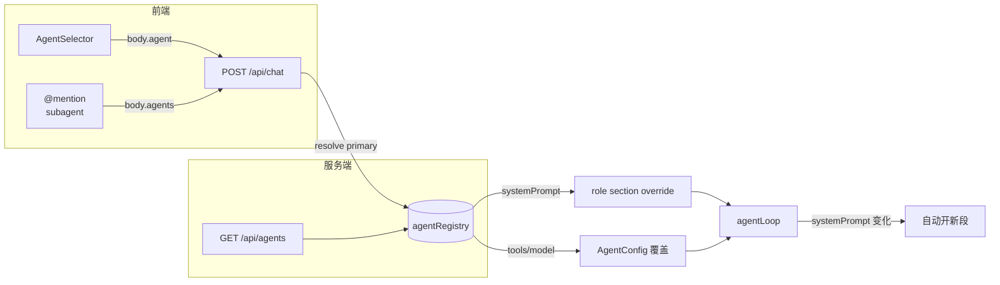

# Agent 前端切换 — 设计文档

> 日期：2026-07-01
> 状态：已批准（待实现）
> 前置：[多 Agent 特性](./2026-06-30-multi-agent-design.md)（subagent 体系已完成，本文实现其"后续"标注的前端选择器）

## 1. 目标与范围

在已有 subagent 体系基础上，实现**主 agent（primary）前端切换** + **`@agent` 调用 subagent**，对标 opencode 的 `build`/`plan` 切换与 `@subagent` 交互。

### 范围

| 能力 | 说明 |
|------|------|
| 内置 primary agent | 新增 `default`（默认行为）+ `plan`（只读计划模式），前端可切换 |
| `GET /api/agents` | 返回所有 agent，按 mode/source 分类，供前端列出 |
| `POST /api/chat` 接受 agent 参数 | `body.agent` 选主 agent；`body.agents` 指定 @ 调用的 subagent |
| role section override | primary agent 的 systemPrompt 覆盖动态 prompt 的 role 段（保留工具/项目等动态上下文） |
| AgentSelector 组件 | 仿 ModelSelector 的下拉切换器，放 modelBar |
| `@` mention 调 subagent | AtFilePopover 扩展：`@` 匹配 subagent/all agent 名，选中注入标记 |

### 非目标

- 斜杠命令 `/agents`（Web 暂用下拉，非 TUI 风格）
- 自定义 agent 的前端编辑器（仅消费 `.c0de/agents/*.md` 加载结果）
- IRC 跨 agent 通信

## 2. 现状分析

c0de-agent 已有完整的 subagent 体系（`src/core/agents/`），但**缺 primary agent 概念**：

- `BUILTIN_AGENTS`（`builtin.ts`）4 个全是 `mode:'subagent'`，0 个 primary
- 主 agent 隐式：`AgentConfig`（`shared/types/agent.ts:19-29`）无 agent 字段，`systemPrompt` 为空
- `loop.ts:345` 构建主 agent prompt：`state.config.systemPrompt ?? buildDynamicPrompt(reg, ctx)`——主 agent 总用默认 registry，role section = `ROLE_DESCRIPTION`
- chat 路由（`routes/chat.ts`）持有 `ctx.agentRegistry` 但**完全没读它**；只看 `body.provider/model/tools`
- 前端：`useComposerDefaults` 管 provider/model/tools，无 agent 状态；`AgentSelector` 不存在
- `AtFilePopover` 仅匹配文件，无 agent mention

**opencode 参考**：`build`/`plan` 两个 primary（mode），前端 `local.agent.list()` 过滤 `mode !== 'subagent' && !hidden`；Tab 循环 + `/agents` 弹窗；每条 message 带 `agent` 字段；`@name` 在输入框注入 subagent part。

## 3. 架构



## 4. 组件详述

### 4.1 内置 Primary Agent（`src/core/agents/builtin.ts`）

新增 2 个 primary agent 到 `BUILTIN_AGENTS`（与现有 4 个 subagent 并列）：

```ts
{
  name: 'default',
  description: '通用助手（默认）。全工具，动态系统提示。',
  systemPrompt: '',        // 空 → 不覆盖 role，走默认 ROLE_DESCRIPTION（当前行为不变）
  mode: 'primary',
  source: 'builtin',
},
{
  name: 'plan',
  description: '计划模式（只读）。专注调研与方案设计，不直接改代码。',
  tools: ['read', 'grep', 'glob', 'bash'],  // 限只读
  systemPrompt: PLAN_ROLE,  // 覆盖 role section
  mode: 'primary',
  source: 'builtin',
}
```

`PLAN_ROLE` 内容（覆盖 role section，priority 0）：

```
You are c0de-agent in **Plan Mode**. Your job is to investigate the codebase and produce a clear, actionable plan — NOT to make changes directly.

- Use read-only tools (grep/glob/read) to understand the structure and relevant code.
- Ask clarifying questions when requirements are ambiguous.
- When ready, present a concrete implementation plan (files to touch, approach, risks).
- Do NOT use edit/write tools to modify code. You may run bash for investigation only.
```

**设计依据**：opencode `plan` primary agent（mode:'primary'，禁用 edit 工具）。c0de-agent 的 role override 机制比 opencode 的整段 prompt 替换更优——只换角色定位，保留工程原则/工具用法/项目上下文等通用段。

**更新 `builtin.test.ts`**：现有 `expect(names).toEqual([...4个])` 需扩展为 6 个（+ default + plan），并新增 primary 模式断言。

### 4.2 role section override 机制（`src/core/loop.ts`）

**问题**：`loop.ts:345` 的 `state.config.systemPrompt` 是**整段替换**（会丢失工具列表/项目上下文等动态段）。primary agent 不能走这条路。

**方案**：`AgentState` 增加 `agentDef?: AgentDefinition`。loop 构建 prompt 时，若 `agentDef.systemPrompt` 非空，在 registry 上 override role section：

```ts
// loop.ts prompt 构建处（约 line 340-348）
const baseReg = deps.promptRegistry ?? createPromptRegistry()
if (state.agentDef?.systemPrompt) {
  // 覆盖 role section（priority 0），保留其余动态段
  registerPromptSection(baseReg, {
    id: 'role',
    content: state.agentDef.systemPrompt,
    priority: 0,
  })
}
const systemPrompt = (state.config.systemPrompt ?? buildDynamicPrompt(baseReg, promptCtx)) + modeHint
```

注意：当 `state.config.systemPrompt` 被显式设置时（subagent 场景，`loop.ts:147`），仍走整段替换，不受影响。primary agent 走 `agentDef.systemPrompt` + 动态 prompt 组合。

### 4.3 chat 路由扩展（`src/server/routes/chat.ts`）

`POST /api/chat` 新增请求参数：

| 参数 | 类型 | 说明 |
|------|------|------|
| `body.agent` | `string?` | 主 agent 名。须 `mode` 为 `primary` 或 `all`。省略 = `default` |
| `body.agents` | `string[]?` | @ 指定的 subagent。须 `mode` 为 `subagent` 或 `all` |

**主 agent 解析逻辑**（在构建 AgentConfig 前）：

```ts
const agentName = (body.agent as string) ?? 'default'
const agentDef = ctx.agentRegistry.get(agentName)
if (!agentDef || agentDef.mode === 'subagent') {
  return apiError(c, 400, 'INVALID_AGENT', `Unknown or non-primary agent: ${agentName}`)
}
// agentDef.tools 覆盖请求 tools（plan 模式限只读）
const tools = agentDef.tools ?? requestedTools
// agentDef.model 覆盖（可选）
const model = agentDef.model ?? requestedModel
```

**`@agent` subagent 注入**：

```ts
const mentionedAgents = (body.agents as string[]) ?? []
// 在 userContent 文本前注入指令（同 opencode prompt.ts 做法，复用 task 工具派生）
if (mentionedAgents.length) {
  const validAgents = mentionedAgents
    .map(n => ctx.agentRegistry.get(n))
    .filter(d => d && d.mode !== 'primary')
  if (validAgents.length) {
    const names = validAgents.map(d => d.name).join(', ')
    userContent[0].text = `[User requested subagent(s): ${names}]\n\n` + userContent[0].text
  }
}
```

**将 agentDef 传入 createAgent**：`createAgent` 签名增加可选 `agentDef` 参数，存入 `state.agentDef`。

**段检测扩展**（`shared/types/agent.ts` + `routes/chat.ts`）：

现有段预检（chat.ts:151-180）比较 provider/model/tools。primary agent 切换若改变 tools（如 default→plan 只读）会触发，但**自定义 primary 若 tools 相同仅 systemPrompt 不同**会漏检 → cache miss。

方案：`LLMSegment` 增加 `agentName?: string` 字段。段预检增加 agent 比较：
```ts
const agentDiffer = active.agentName !== agentName
// ...if ((modelDiffer || toolsDiffer || agentDiffer) && !confirmed)
```
loop 创建新段时存 `agentName: state.agentDef?.name`。', 'system_prompt_change' 分支已在 loop.ts:549 覆盖（fingerprint 含 systemPrompt）。

### 4.4 `GET /api/agents`（新 `src/server/routes/agent.ts`）

```ts
// 返回所有 agent，前端按 mode 过滤
app.get('/', (c) => {
  const all = ctx.agentRegistry.list()
  return c.json({
    agents: all.map(d => ({
      name: d.name,
      description: d.description,
      mode: d.mode,
      source: d.source,
      hasTools: !!d.tools,
    })),
  })
})
```

在 `app.ts` 注册：`app.route('/api/agents', createAgentRoute(ctx))`。

### 4.5 AgentSelector 组件（`src/web/components/AgentSelector.tsx`）

仿 `ModelSelector` 的下拉样式（`selectControl`），放 `modelBar` slot。

```tsx
export function AgentSelector({
  value,           // 当前选中 agent name
  onChange,        // (name) => void
  agents,          // AgentListItem[]（useQuery 获取）
}: { ... }) {
  const primary = agents.filter(a => a.mode !== 'subagent')
  return (
    <select value={value} onChange={e => onChange(e.target.value)}>
      {primary.map(a => <option key={a.name} value={a.name}>{a.name}</option>)}
    </select>
  )
}
```

`useComposerDefaults` 增加 `agent` state + localStorage 持久化（key: `c0de-agent:selectedAgent`）。发消息时 `opts.agent = agent`。

### 4.6 `@` mention 扩展（`src/web/composer/AtFilePopover.tsx`）

当前 `@` 触发 `useFileSearch` 匹配文件。扩展为：`@` 同时匹配 subagent/all agent 名（从 `useAgents` query），选中后注入标记 `@agentName`。

`Composer` 的 `SendPayload` 增加字段：

```ts
type SendPayload = {
  text: string
  files: string[]
  images: ImagePart[]
  agents: string[]   // ← 新增：@ 提及的 subagent 名
}
```

`ChatView.handleSend` 把 `payload.agents` 放入 `opts.agents`。

## 5. 数据流

### 切换 primary agent

1. 用户在 AgentSelector 选 `plan`
2. `useComposerDefaults.agent` 更新 + localStorage 持久化
3. 下次发消息：`body.agent = 'plan'`
4. chat 路由：`agentRegistry.get('plan')` → tools 限只读、systemPrompt 覆盖 role
5. loop 构建 prompt：role section = PLAN_ROLE，保留工程原则/工具列表/项目上下文
6. systemPrompt 指纹变化 → **自动开新段**（复用现有 `SegmentTrigger: 'system_prompt_change'`）
7. 若已有活跃段且前缀不同 → 返回 409 SEGMENT_BREAK_REQUIRED → 前端弹 SegmentBreakDialog 确认

### `@coder` 调用 subagent

1. 用户输入 `@coder 帮我实现 X`
2. AtFilePopover 匹配 `coder`（mode subagent），选中注入 `@coder`
3. 发送：`body.agents = ['coder']`，`body.message = '帮我实现 X'`
4. chat 路由在 message 前注入 `[User requested subagent(s): coder]`
5. 主 agent 收到指令，通过 `task` 工具派生 coder subagent（现有机制，零新增调用路径）

## 6. 测试策略

### 后端（按 AGENTS.md 测试放置规范）

| 测试 | 文件 | 验证点 |
|------|------|--------|
| builtin primary | `src/core/agents/builtin.test.ts`（已有） | 6 个 agent 含 default/plan，2 个 primary |
| role override | `src/core/loop.test.ts`（已有） | agentDef.systemPrompt 覆盖 role，保留工具段 |
| chat agent 参数 | `src/server/routes/chat.test.ts`（已有） | body.agent 解析、tools 覆盖、无效 agent 400 |
| agents API | `src/server/routes/agent.test.ts`（新建，仅此文件） | GET /api/agents 返回、mode 过滤 |
| @ 注入 | `src/server/routes/chat.test.ts`（已有） | body.agents 注入指令前缀 |

注：agents API 路由测试为独立新模块（符合"新建文件仅当都不适用"规范），其余追加到已有文件。

### 前端

| 测试 | 文件 | 验证点 |
|------|------|--------|
| AgentSelector | `src/web/components/AgentSelector.test.tsx`（新建） | 渲染 primary、切换回调 |
| @ mention | `src/web/composer/AtFilePopover.test.tsx`（如有） | agent 匹配、注入 |

## 7. 文件清单

| 层 | 文件 | 改动类型 |
|---|---|---|
| core | `src/core/agents/builtin.ts` | 改：+2 primary + PLAN_ROLE |
| core | `src/core/agents/builtin.test.ts` | 改：扩展断言 |
| core | `src/core/agent.ts` | 改：createAgent 加 agentDef 参数 |
| core | `src/core/loop.ts` | 改：role override 逻辑 |
| core | `src/shared/types/agent.ts` | 改：AgentState 加 agentDef |
| server | `src/server/routes/agent.ts` | 新：GET /api/agents |
| server | `src/server/routes/chat.ts` | 改：agent/agents 参数 |
| server | `src/server/app.ts` | 改：注册 agent 路由 |
| web | `src/web/components/AgentSelector.tsx` | 新 |
| web | `src/web/hooks/useComposerDefaults.ts` | 改：agent state |
| web | `src/web/views/ChatView.tsx` | 改：modelBar 加 AgentSelector |
| web | `src/web/composer/AtFilePopover.tsx` | 改：agent 匹配 |
| web | `src/web/composer/Composer.tsx` | 改：SendPayload 加 agents |
| web | `src/web/services/agent.ts` | 改：listAgents API |
