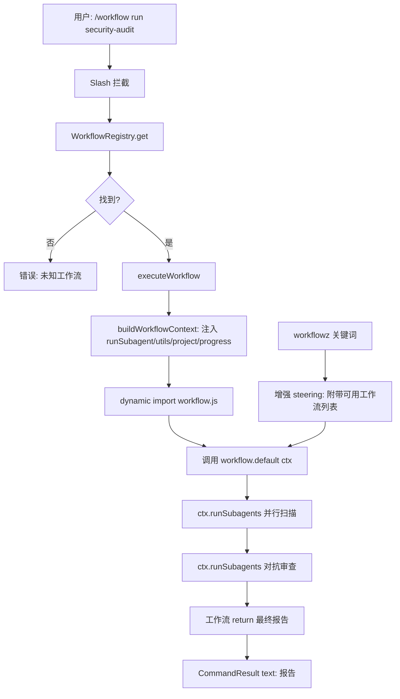

# Dynamic Workflow 系统 — 设计文档

> 日期：2026-07-11
> 状态：已批准
> 参考：Claude Code Dynamic Workflow、oh-my-pi modes/workflow.ts、c0de-agent multi-agent-design

## 1. 目标与范围

为 c0de-agent 增加完整的 Dynamic Workflow 能力：用户通过自然语言、预设模板或 `/workflow` 命令启动编排式多阶段工作流，工作流以 JS 脚本表达编排逻辑（条件、循环、变量），在后台并行执行，子 agent 结果经交叉验证后产出结构化最终报告。

### 核心能力

| 能力 | 说明 |
|------|------|
| JS 编排脚本 | `.c0de/workflows/*.js` 导出 `meta` + `default async function(ctx)` |
| 工作流注册表 | 三级发现：builtin → `~/.c0de/workflows/` → `.c0de/workflows/` |
| `/workflow` 命令 | `run`/`list`/`show`/`save`/`delete` 子命令 |
| 后台并行执行 | 工作流在主 agent loop 外独立运行，SSE 推送进度 |
| 结构化报告 | 工作流 `return` 的结果作为最终产出 |
| `workflowz` 增强 | steering 通知附带可用工作流列表，引导模型选择或编排 |
| 内置模板 | 3 个开箱即用工作流（security-audit / code-review / migration-check） |
| 前端可视化 | phase 进度条 + 子 agent 节点树 + 后台工作流面板 |

### 非目标

- 工作流脚本沙箱隔离 — 完全信任模型，类比 npm scripts / git hooks
- IRC 跨工作流通信
- 工作流版本管理 / 回滚
- 工作流 marketplace / 远程分享

### 安全模型

工作流脚本是 `dynamic import` 的 ES module，拥有完整 Node/Bun 访问权限（fs、process、exec）。安全靠用户审核脚本内容。AI 生成的脚本首次保存时需用户确认。这与 npm scripts (`postinstall`)、git hooks (`pre-commit`) 的信任级别一致。

## 2. 现状分析

c0de-agent 已有：

- `src/core/workflow.ts`：`workflowz` 关键词检测 + steering 注入
- `src/core/loop.ts:122`：`runSubAgent()` — 按 agent 类型派发隔离子 agent（已有 worktree 隔离、yield 收集器、工具集限制）
- `src/core/agents/`：AgentDefinition 注册表 + discovery + 6 个内置 agent
- `src/core/slash.ts`：Slash 命令系统（`/compact`、`/model`、`/clear`、`/help`、`/fork`、`/config`）
- `src/web/components/session/WorkflowGraph.tsx`：工作流图可视化（根节点 + 子节点卡片）
- `src/web/composer/editor-sync.ts`：`workflowz` 关键词高亮
- `src/server/routes/commands.ts`：`GET /api/commands` 返回斜杠命令列表

**缺口**：无工作流脚本格式与执行引擎；无工作流注册表/发现；无 `/workflow` 命令；无工作流 SSE 进度流；无内置模板；WorkflowGraph 无 phase 概念。

## 3. 架构总览

```
src/core/workflows/              ← 新模块
  ├─ types.ts                    WorkflowMeta, WorkflowModule, WorkflowContext, WorkflowResult
  ├─ discovery.ts                .c0de/workflows/*.js + ~/.c0de/workflows/*.js 动态 import
  ├─ registry.ts                 WorkflowRegistry（内存 Map，三级合并）
  ├─ context.ts                  buildWorkflowContext（注入 runSubagent/utils/progress）
  ├─ runtime.ts                  executeWorkflow（加载 → 构建 ctx → 执行 → 追踪进度）
  ├─ builtins.ts                 3 个内置工作流源码（作为字符串内联，动态 import 执行）
  └─ index.ts                    barrel

src/core/slash.ts                ← 新增 workflowCommand
src/core/workflow.ts             ← 增强 WORKFLOW_NOTICE（附带可用工作流列表）
src/server/routes/workflows.ts   ← 新增 REST API 路由
src/server/app.ts                ← 注册 /api/workflows 路由
src/web/components/session/      ← WorkflowGraph 增强 + WorkflowRunner 新建
```



## 4. 组件详述

### 4.1 类型定义（`src/core/workflows/types.ts`）

```typescript
/** 工作流元数据（脚本导出的 meta 对象）。 */
interface WorkflowMeta {
  name: string                      // 唯一标识，同时也是 slash 命令名
  description: string               // 显示用描述
  argsHint?: string                 // 参数提示（如 '[扫描目标描述]'）
  phases?: string[]                 // 执行阶段标签（用于进度展示）
}

/** 工作流脚本模块（dynamic import 后的形状）。 */
interface WorkflowModule {
  meta: WorkflowMeta
  default: (ctx: WorkflowContext) => Promise<WorkflowResult>
}

/** 工作流上下文（注入给脚本 default 函数的参数）。 */
interface WorkflowContext {
  /** 项目信息。 */
  project: { rootDir: string; name: string; gitBranch?: string }
  /** 用户传入的参数字符串（/workflow run <name> 后面的部分）。 */
  args: string
  /** 派发单个子 agent。委托 runSubAgent。 */
  runSubagent: (type: string, params: {
    assignment: string
    description?: string
    model?: string
  }) => Promise<WorkflowAgentResult>
  /** 批量并行派发子 agent。委托 runSubAgent，concurrency pool。 */
  runSubagents: (
    type: string,
    tasks: Array<{ assignment: string; description?: string; role?: string }>,
    context?: string,
  ) => Promise<WorkflowAgentResult[]>
  /** 进度上报（→ SSE → 前端）。 */
  progress: (message: string, detail?: unknown) => void
  /** 内置工具（受限文件系统操作）。 */
  utils: WorkflowUtils
}

/** 子 agent 返回结果。 */
type WorkflowAgentResult =
  | { ok: true; output: string; data?: unknown }
  | { ok: false; error: string }

/** 工作流内置工具集。 */
interface WorkflowUtils {
  glob: (pattern: string) => Promise<string[]>
  grep: (pattern: string, path?: string) => Promise<Array<{ path: string; line: number; text: string }>>
  read: (path: string, range?: { start: number; end: number }) => Promise<string>
  splitByDirectory: (
    rootDir: string,
    opts?: { depth?: number; ignore?: string[] },
  ) => Promise<Array<{ name: string; path: string; files: string[] }>>
}

/** 工作流执行结果。 */
type WorkflowResult = {
  output?: string                    // 人类可读总结（显示给用户）
  data?: unknown                     // 结构化数据（存档/程序化消费）
}

/** 注册表中的条目。 */
interface WorkflowEntry {
  meta: WorkflowMeta
  source: 'builtin' | 'user' | 'project'
  filePath?: string                  // 文件路径（user/project 源）
  /** 执行器：对 builtin 是内联函数，对文件源是 dynamic import 后的 default。 */
  execute: (ctx: WorkflowContext) => Promise<WorkflowResult>
  /** 源码文本（show 命令和编辑用）。 */
  sourceCode?: string
}
```

### 4.2 发现与注册表（`discovery.ts` + `registry.ts`）

**发现顺序**（后者覆盖同名前者）：
1. `builtins.ts` 内置工作流（source: 'builtin'）
2. 用户全局 `~/.c0de/workflows/*.js`（source: 'user'）
3. 项目 `.c0de/workflows/*.js`（source: 'project'）

**Discovery API**：

```typescript
async function discoverWorkflows(projectDir: string): Promise<WorkflowEntry[]>
```

- 扫描两个目录的 `.js` 文件（不支持 `.ts`，避免编译需求）
- 每个文件 `await import(fileURL)` → 校验 `meta` 和 `default` 存在
- 文件名（去 `.js`）作为 fallback name（meta.name 优先）
- 读取源码文本存入 `sourceCode`
- import 失败的文件跳过并 warn（不阻塞其他工作流）

**Registry API**：

```typescript
interface WorkflowRegistry {
  register(entry: WorkflowEntry): void
  get(name: string): WorkflowEntry | undefined
  list(): WorkflowEntry[]
  has(name: string): boolean
  delete(name: string): boolean
}

async function createWorkflowRegistry(projectDir: string): Promise<WorkflowRegistry>
```

### 4.3 执行上下文（`context.ts`）

```typescript
function buildWorkflowContext(opts: {
  deps: AgentDependencies
  parent: AgentState
  args: string
  onProgress: (message: string, detail?: unknown) => void
}): WorkflowContext
```

**关键映射**：

| ctx API | 委托目标 | 说明 |
|---------|---------|------|
| `runSubagent(type, params)` | `runSubAgent(deps, parent, { agentType: type, prompt: params.assignment, ... })` | 单任务派发，返回 `{ ok, output, data }` |
| `runSubagents(type, tasks, context)` | 循环调用 `runSubAgent`（concurrency pool） | 批量并行，结果按输入顺序 |
| `utils.glob` | `node:fs/promises` + glob 逻辑 | 复用 fast-glob 或简单递归 |
| `utils.grep` | `src/tools/builtin/grep.ts` 的核心逻辑 | 正则搜索 |
| `utils.read` | `node:fs/promises.readFile` | 带行范围 |
| `utils.splitByDirectory` | 基于 glob 扫描目录结构 | 按子目录拆分模块 |
| `progress` | `onProgress` 回调 | → SSE → 前端 |

**runSubagent 返回值映射**：

```typescript
const result = await runSubAgent(deps, parent, {
  agentType: type,
  prompt: params.assignment,
  description: params.description,
  model: params.model,
})
if (result._tag === 'success') {
  return { ok: true, output: result.output, data: result.data }
}
return { ok: false, error: result.error }
```

### 4.4 执行引擎（`runtime.ts`）

```typescript
async function executeWorkflow(opts: {
  registry: WorkflowRegistry
  name: string
  args: string
  deps: AgentDependencies
  parent: AgentState
  onProgress?: (message: string, detail?: unknown) => void
}): Promise<CommandResult>
```

**执行流程**：
1. `registry.get(name)` → 未找到返回 error
2. `buildWorkflowContext(...)` → 构建 ctx
3. `entry.execute(ctx)` → 调用工作流 default 函数
4. 工作流 `return` 的 `output` 作为 `CommandResult._tag: 'text'`
5. 异常捕获 → `CommandResult._tag: 'error'`

**错误处理**：
- 工作流脚本 throw → 捕获异常 message 返回 error
- 子 agent 失败 → `runSubagent` 返回 `{ ok: false }`，脚本自行决定如何处理（重试/跳过/终止）
- 子 agent background 模式 → 工作流 ctx 不暴露 background（工作流脚本只做同步 fan-out）

### 4.5 内置工作流模板（`builtins.ts`）

3 个开箱即用工作流，以**源码字符串**形式内联（便于 `show` 和修改后保存）：

#### security-audit（安全审计）

```javascript
export const meta = {
  name: 'security-audit',
  description: '并行安全审计：按目录拆分扫描 → 独立审查员交叉验证 → 汇总报告',
  argsHint: '[扫描目标描述]',
  phases: ['scan', 'verify', 'report'],
}

export default async function workflow(ctx) {
  const { runSubagents, utils, progress, project, args } = ctx

  progress('拆分代码库为模块...')
  const modules = await utils.splitByDirectory(project.rootDir, { depth: 2 })

  progress(`并行扫描 ${modules.length} 个模块...`, { phase: 'scan' })
  const scans = await runSubagents('researcher', modules.map((m) => ({
    assignment: `你是安全扫描专家。扫描目录 ${m.path} 下的代码，检查以下安全风险：
- SQL 注入风险
- 硬编码密钥 / 密码 / Token
- 权限绕过模式
- XSS / CSRF 风险
- 不安全的依赖使用

文件列表：${m.files.slice(0, 50).join(', ')}

返回 JSON：{ findings: [{ severity: 'critical|warning|info', file, line, issue, evidence }] }`,
    description: `扫描 ${m.name}`,
  })))

  const allFindings = scans
    .filter((r) => r.ok)
    .flatMap((r) => { try { return JSON.parse(r.output).findings ?? [] } catch { return [] } })

  progress(`交叉验证 ${allFindings.length} 个发现...`, { phase: 'verify' })
  const verified = await runSubagents('reviewer', allFindings.map((f) => ({
    assignment: `对抗审查以下安全发现，判断是否为真实问题还是误报：
${JSON.stringify(f, null, 2)}

返回 JSON：{ confirmed: boolean, reason: string, adjustedSeverity?: 'critical|warning|info' }`,
    description: '验证发现',
  })))

  const confirmed = verified
    .filter((r) => r.ok)
    .map((r) => { try { return JSON.parse(r.output) } catch { return null } })
    .filter((v) => v?.confirmed)

  progress(`生成报告...`, { phase: 'report' })
  const summary = `扫描 ${modules.length} 个模块，发现 ${allFindings.length} 个候选问题，${confirmed.length} 个经交叉验证确认。`

  return { output: summary, data: { confirmed, totalCandidates: allFindings.length } }
}
```

#### code-review（代码审查）

- 按维度拆分（correctness / security / performance / maintainability）
- 每维度独立 reviewer 子 agent
- 汇总去重后输出

#### migration-check（迁移检查）

- 对比两个分支/commit 的 diff
- 拆分为 breaking changes / deprecated / new features
- 每类独立分析

### 4.6 Slash 命令（`slash.ts` 新增）

```
/workflow                    → 列出所有可用工作流
/workflow run <name> [args]  → 执行工作流
/workflow show <name>        → 显示工作流源码
/workflow save <name>        → 将参数中的脚本内容保存为新工作流
/workflow delete <name>      → 删除用户/项目级工作流（builtin 不可删）
```

**实现**：新增 `workflowCommand: SlashCommand`，在 `CommandContext` 中注入 `workflowRegistry`。

**CommandContext 变更**：

```typescript
type CommandContext = {
  cwd: string
  config: Config
  deps: AgentDependencies
  workflowRegistry?: WorkflowRegistry  // ← 新增
}
```

`workflowCommand.execute` 根据 args 的第一个词路由到子命令。

### 4.7 Server 路由（`routes/workflows.ts`）

```
GET    /api/workflows              → 列出（name/description/phases/source）
GET    /api/workflows/:name        → 元数据 + 源码
POST   /api/workflows/:name/run    → 执行（body: { args?, background? }）
POST   /api/workflows              → 保存新工作流（body: { name, source }）
DELETE /api/workflows/:name        → 删除
GET    /api/workflows/:name/stream → SSE 进度流
```

**执行端点**：`POST /api/workflows/:name/run` 在请求生命周期内执行工作流，通过 SSE 推送 `progress` 事件，工作流完成后推送 `result` 事件并关闭流。

### 4.8 `workflowz` 关键词增强（`workflow.ts`）

当前 `WORKFLOW_NOTICE` 是静态文本。增强为：当检测到 `workflowz` 关键词时，动态生成 steering，在通知末尾附加已注册工作流列表：

```
<registered-workflows>
Available workflow templates you can invoke with the task tool's workflow parameter:
- security-audit: 并行安全审计 + 交叉验证
- code-review: 多维度代码审查
- migration-check: 迁移影响检查
If none fit, orchestrate inline using runSubagent fan-out as described below.
</registered-workflows>
```

**变更**：`containsWorkflow` 逻辑不变；`WORKFLOW_NOTICE` 从常量改为函数 `buildWorkflowNotice(availableWorkflows)`，在 `chat.ts` 注入时传入当前注册表列表。

### 4.9 前端增强

#### WorkflowGraph 增强

新增 `phases` prop，在根节点下方渲染 phase 进度条：

```
[✓ scan] → [◐ verify] → [○ report]
```

#### SlashPopover

`/workflow` 出现在斜杠命令列表。`/workflow run <name>` 支持子命令补全。

#### WorkflowRunner 面板（新组件）

后台工作流进度面板（可折叠）：
- 当前 phase 高亮
- 子 agent 节点树（复用 WorkflowGraph）
- progress 消息流
- 最终报告展示

## 5. 数据流

### 前台执行（`/workflow run`）

```
用户输入 → chat.ts slash 拦截 → workflowCommand.execute
  → executeWorkflow → buildWorkflowContext → entry.execute(ctx)
  → ctx.runSubagents → runSubAgent × N（子 agent 事件 → SSE → 前端）
  → ctx.progress（→ CommandResult 元数据 → 前端）
  → 工作流 return → CommandResult text → 注入为 assistant 消息
```

### 后台执行（`POST /api/workflows/:name/run`）

```
POST → executeWorkflow（async）→ 立即返回 jobId
工作流在后台运行 → progress 事件写入 SSE 队列
前端 GET stream → 持续接收 progress → 最终 result
```

## 6. 错误处理

| 场景 | 处理 |
|------|------|
| 未知工作流名 | `CommandResult._tag: 'error'`，提示可用列表 |
| 工作流脚本 import 失败 | discovery 阶段跳过 + warn；运行时返回 error |
| 工作流脚本 throw | 捕获，返回 error，message 含异常信息 |
| 子 agent 全部失败 | 脚本自行处理（检查 ok 字段）；不重试 |
| `utils.grep/read` 路径越界 | 限制在 project.rootDir 内，越界返回空/错误 |
| 工作流超时 | 可选 `meta.timeout` 字段（秒），超时终止并返回 error |

## 7. 测试策略

| 层级 | 文件 | 覆盖 |
|------|------|------|
| 类型 | `types.test.ts` | WorkflowMeta/Module/Context 类型编译检查 |
| Discovery | `discovery.test.ts` | 文件加载、frontmatter 解析、三级合并、import 失败容错 |
| Registry | `registry.test.ts` | register/get/list/has/delete、同名覆盖 |
| Context | `context.test.ts` | runSubagent→runSubAgent 委托、utils.glob/grep/read、progress 回调 |
| Runtime | `runtime.test.ts` | 正常执行、未知名、脚本 throw、return 值映射 |
| Slash | `slash.test.ts` 追加 | workflow 命令路由（list/run/show/save/delete） |
| 内置工作流 | `builtins.test.ts` | 3 个模板的 meta 校验 + mock ctx 执行 |
| 集成 | `workflow.integration.test.ts` | 端到端：写 .js → discover → execute → 验证结果 |

## 8. 文件清单

### 新增

| 文件 | 行数估算 |
|------|----------|
| `src/core/workflows/types.ts` | ~80 |
| `src/core/workflows/discovery.ts` | ~120 |
| `src/core/workflows/registry.ts` | ~50 |
| `src/core/workflows/context.ts` | ~150 |
| `src/core/workflows/runtime.ts` | ~80 |
| `src/core/workflows/builtins.ts` | ~200 |
| `src/core/workflows/index.ts` | ~20 |
| `src/server/routes/workflows.ts` | ~150 |
| `src/web/components/session/WorkflowRunner.tsx` | ~200 |
| 测试文件（7 个） | ~800 |

### 修改

| 文件 | 变更 |
|------|------|
| `src/core/slash.ts` | 新增 `workflowCommand`，注册到 `builtinCommands` |
| `src/core/types.ts` | `CommandContext` 新增 `workflowRegistry?` |
| `src/core/workflow.ts` | `WORKFLOW_NOTICE` → `buildWorkflowNotice(workflows)` |
| `src/server/routes/chat.ts` | 注入 workflowRegistry 到 CommandContext；调用 buildWorkflowNotice |
| `src/server/app.ts` | 注册 `/api/workflows` 路由 |
| `src/server/context.ts` | ServerContext 新增 `workflowRegistry`，bootstrap 时创建 |
| `src/server/types.ts` | ServerContext 类型新增 `workflowRegistry` |
| `src/web/components/session/WorkflowGraph.tsx` | 新增 `phases` prop + phase 进度条 |
| `src/web/composer/SlashPopover.tsx` | `/workflow` 子命令补全 |
| `src/web/components/session/TaskToolView.tsx` | 传递 phases 到 WorkflowGraph |

## 9. 实现顺序

1. **types.ts** — 类型定义（无依赖）
2. **registry.ts** — 注册表（依赖 types）
3. **discovery.ts** — 发现（依赖 types + registry）
4. **builtins.ts** — 内置模板（依赖 types）
5. **context.ts** — 执行上下文（依赖 types + loop.runSubAgent）
6. **runtime.ts** — 执行引擎（依赖以上全部）
7. **slash.ts** — slash 命令接线
8. **server** — 路由 + context 装配
9. **workflow.ts** — steering 增强
10. **前端** — WorkflowGraph 增强 + WorkflowRunner + SlashPopover
11. **集成测试** — 端到端验证
