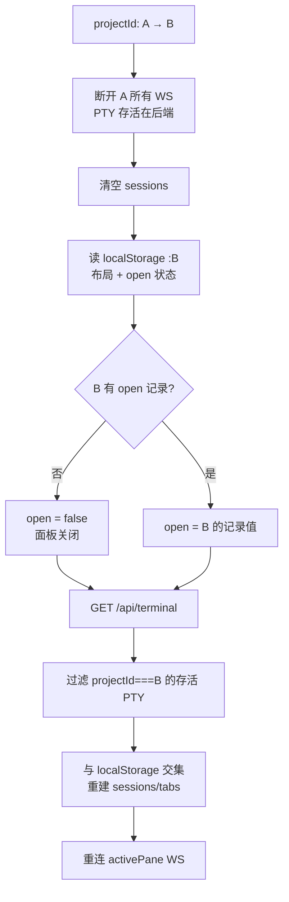

# 终端按项目隔离设计

> 日期：2026-07-13
> 背景：当前终端会话与项目完全解耦，切换项目时终端面板继续显示所有项目的终端。本设计让终端实例绑定到项目，切换项目即切换可见的终端集合。

## 1. 问题诊断

终端与项目在三个层面都没有「归属」概念：

| 层面 | 现状 | 后果 |
|---|---|---|
| 前端 `useTerminal` | 在 `ChatPage` 内调用，React Router 切换 `projectId` 时组件不 unmount，state 全程共享 | 切项目后 sessions 列表不变 |
| 持久化 | 全局 key `c0de-agent:terminalSessions` / `c0de-agent:terminalOpen`，无 projectId 维度 | 所有项目的终端混存；面板开关跨项目沿用 |
| 后端 `PTYManager` | PTY 全局进程池，`PTYInfo.cwd` 是创建快照，用户 `cd` 后不更新 | 无法靠 cwd 实时归属 |
| `createTerminal` | 传了 `{ cwd: project.worktree }` 但 session 不记 projectId | 新终端不绑定到任何项目 |

**核心需求**：终端实例绑定项目。切换项目 = 切换可见终端集合 + 面板开关状态；PTY 进程在切换时保留存活，切回可恢复。

**补充约束**：切换到一个未打开过终端的项目时，终端面板应为关闭状态，不自动创建终端。

## 2. 设计决策

两个架构取舍（已确认）：

1. **PTY 生命周期**：切换项目时**保留并隐藏**非当前项目的 PTY 进程，只断开 WebSocket；切回时重连恢复。与现有「卸载只断 WS、PTY 保持存活可重连」的设计哲学一致。
2. **归属信息数据源**：**后端 PTY 记 projectId**（权威），前端 localStorage 记 tab/pane 布局。单一数据源：清缓存、多标签页、刷新都能正确归属。

## 3. 后端改动 — PTY 携带 projectId

### 3.1 `PTYInfo` / `CreatePTYOptions`

`src/server/terminal/pty-manager.ts`：

- `CreatePTYOptions` 增加 `projectId?: string`
- `PTYInfo` 增加 `projectId?: string`
- `create()`：将 `opts.projectId` 写入返回的 `info.projectId`
- `list()` 已返回 `{ ...e.info }`，自然带出 projectId，无需额外改动

可选性（`projectId?:`）保持向后兼容：无 projectId 的 PTY 视为「未归属」，前端按 projectId 过滤时不会归属到任何具体项目。

### 3.2 路由透传

`src/server/routes/terminal.ts` POST：从 body 读 `projectId`（字符串校验），透传给 `mgr.create()`。

### 3.3 不改 cwd 语义

`PTYInfo.cwd` 维持现状——它是 shell 的初始工作目录（创建快照），不是归属键。归属统一由 `projectId` 表达。`resize` / `setTitle` 都不碰 cwd。

### 3.4 测试

`src/server/routes/terminal.test.ts`：
- `POST /` 带 `projectId` 创建，`GET /` 返回的 info 含 `projectId`
- `POST /` 不带 `projectId`，info.projectId 为 undefined（向后兼容）

## 4. 前端 hook 改动 — `useTerminal(projectId)`

### 4.1 签名与状态分桶

`src/web/hooks/useTerminal.ts`：

hook 接收 `projectId: string` 参数。所有按项目隔离的状态以 projectId 为分桶键：

| 状态 | 旧 key（全局） | 新 key（按项目） |
|---|---|---|
| sessions 布局 | `c0de-agent:terminalSessions` | `c0de-agent:terminalSessions:${projectId}` |
| 面板开关 open | `c0de-agent:terminalOpen` | `c0de-agent:terminalOpen:${projectId}` |
| 面板高度 height | `c0de-agent:terminalHeight` | 不变（全局，UI 偏好与项目无关） |

- `loadOpen(projectId)`：读项目级 key，无记录默认 `false`
- `loadPersistedState(projectId)`：读项目级 key
- `savePersistedState` / `toggleOpen` / `setHeight`：写对应 key（height 仍写全局）

### 4.2 session 携带 projectId

`createTerminal` / `splitTerminal`：
- 接收 `projectId`（透传自 hook 的 `projectId` 参数）
- 传给 `terminalAPI.create({ cwd, projectId, ... })`
- 后端返回的 `info.projectId` 随 session 存储（session 类型已 extends TerminalInfo，天然携带）

### 4.3 projectId 切换时的恢复（核心）

新增 `useEffect([projectId])`，切换项目时：

```
projectId 变化（含首次）:
  1. 断开当前所有 session 的 WebSocket（PTY 存活在后端）
  2. 清空 sessions / tabSplits / activeTabId / activePaneId
  3. setRestoring(true)
  4. 读 localStorage["...:${projectId}"]（布局） + 读 localStorage["...open:${projectId}"]（面板开关）
  5. setOpen(项目级 open 值)
  6. GET /api/terminal → 全量 PTY 列表
  7. 过滤 info.projectId === projectId 的存活 PTY
  8. 与 localStorage 记录取交集 → 重建 sessions/tabs/active
  9. setRestoring(false)
  10. 重连 activePane 的 WebSocket
```

恢复筛选条件（第 7 步）：`liveIds` 中只保留 `info.projectId === projectId` 的 PTY。这是「后端记 projectId 为权威」的直接体现——即使 localStorage 丢失，仍能按后端 projectId 把 PTY 归属到正确项目。

### 4.4 open 与自动创建的配合

`open` 按项目分桶后，行为矩阵（切到项目 B）：

| B 的情况 | open | 面板 | 说明 |
|---|---|---|---|
| 从没碰过终端（无 sessions） | false | 关闭 | 本次需求的核心约束 |
| B 有终端会话但用户关掉了面板 | false | 关闭 | 尊重上次状态 |
| B 有终端且面板开着 | true | 展开 | 切回原样 |

`TerminalPanel` 的自动创建逻辑（`open && tabs.length===0 && cwd`）无需特判：open=false 时根本不触发，新项目切过去不会偷偷建终端。用户主动 `Ctrl+\`` 或点按钮打开时，才在该项目 cwd 建首个终端。

### 4.5 测试

`src/web/hooks/useTerminal.test.ts`（新增）：
- `createTerminal({ projectId })` → 后端收到的 create 请求含 projectId
- 切 projectId：旧项目 WS 断开、sessions 清空、新项目按 projectId 过滤重建
- 持久化分桶：项目 A 的终端布局写入 `terminalSessions:${A}`，项目 B 独立
- open 分桶：切到无终端记录的项目，open=false

## 5. 前端组件改动

### 5.1 `ChatPage`（`src/web/App.tsx`）

`const terminal = useTerminal(projectId)` —— 传入路由 projectId。

### 5.2 `TerminalPanel`（`src/web/components/TerminalPanel.tsx`）

- props 增加 `projectId: string`
- `handleNewTab`：`createTerminal({ cwd, projectId })`
- `handleSplit`：`splitTerminal({ cwd, projectId, direction })`
- 自动创建 effect：`createTerminal({ cwd, projectId })`
- 自动创建逻辑的触发条件（`open && !restoring && tabs.length===0 && cwd`）不变

### 5.3 测试

`src/web/components/TerminalPanel.test.tsx`（如无则新增，或在现有测试文件追加）：
- 创建终端时 create 请求携带 projectId 与 cwd
- 切换 projectId 后面板显示新项目的终端

## 6. 数据流（切换项目 A → B）



切回 B → A 对称：A 的 PTY 仍在后端，按 projectId 重新归属、重连 WS、恢复 open 状态。

## 7. 边界情况

- **旧 localStorage key（无 projectId）**：不再读取，等同丢弃。PTY 本是内存态，服务重启即清空，可接受。
- **多标签页同步**：后端 PTY 列表为权威，A 标签页关掉的终端，B 标签页 `list()` 不再返回，自然过滤掉。
- **无 projectId 的 PTY（兼容）**：前端按 `info.projectId === projectId` 严格过滤，未归属 PTY 不在任何项目显示。
- **PTY 在后端退出（shell 退出）**：`list()` 不再返回，恢复时被过滤，与现有 `onExit` 清理逻辑一致。

## 8. 改动面汇总

| 文件 | 改动 |
|---|---|
| `src/server/terminal/pty-manager.ts` | `PTYInfo` / `CreatePTYOptions` 加 projectId，create 写入 |
| `src/server/routes/terminal.ts` | POST 读 body.projectId 透传 |
| `src/server/routes/terminal.test.ts` | 加 projectId 创建/列出用例 |
| `src/web/hooks/useTerminal.ts` | 接收 projectId；sessions + open 分桶；切换恢复 |
| `src/web/hooks/useTerminal.test.ts` | 新增：切换、过滤、分桶持久化用例 |
| `src/web/App.tsx` | `useTerminal(projectId)` |
| `src/web/components/TerminalPanel.tsx` | props 加 projectId，创建/分屏调用补 projectId |
| `src/web/components/TerminalPanel.test.tsx` | 创建终端携带 projectId 用例 |

无 DB schema 变更（PTY 不入库，纯内存态）。

## 9. 非目标

- 不追踪 shell 内 `cd` 后的实时 cwd（成本高且无归属价值）。
- 不做跨项目终端迁移/拖拽。
- 不改面板高度为按项目存储（全局 UI 偏好）。
